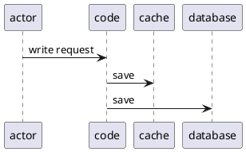
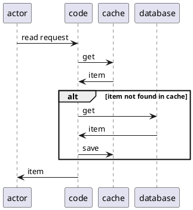
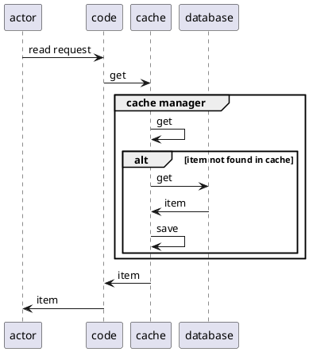

**Cache aside** - application's code handles both write and read requests to both database and cache. Also responsible for error handling.

**Read through** - application's code sends request only to cache. Cache manager handles updates.

**Write through** - same as above but for write.

**Write behind** - same as above but call from cache manager to database is asynchronous.

**Refresh ahead** - job updates data in cache periodically.

### Missing

- What are the use cases for each type? 
- How to reason about them?
- Drawbacks
- TTL


### References
[Hazelcast blog post - A Hitchhiker’s Guide to Caching Patterns](https://hazelcast.com/blog/a-hitchhikers-guide-to-caching-patterns/)
[docs.aws.amazon.com](https://docs.aws.amazon.com/whitepapers/latest/database-caching-strategies-using-redis/caching-patterns.html) --> only two general types discussed

---
# Active Recalls
## Second recall from memory
after few hours, no re-reading

#### Something Aside

The most popular type and easiest to reason about, most intuitive. Code handles writing to cache, database and updating cache.

*Write*



![[Pasted image 20260206174701.png]]

*Read*



![[Pasted image 20260206175847.png]]

#### Write through

In pattern above code needs to handle possible failure from database save. In write through pattern cache manager handles saving to database.

```
@startuml
actor -> code : write request

code -> cache : save

group cache manager

cache -> cache : save

cache -> database : save

end
@enduml
```

![[Pasted image 20260206181413.png]]

#### Read through




![[Pasted image 20260206181117.png]]


#### Write behind

Same as above but write from cache to database is asynchronous.

#### Jet sync

There is a job (jet) that prefetches data and saves in cache periodically. Writing and reading from database is the biggest bottleneck and it avoid it. It does put overhead on cache, and does not guarantee data is up to date between fetching.

```
@startuml

loop every x amount of time

jet -> database : get

database -> jet : item

jet -> cache : save item

end


actor -> code : get request

code -> cache : get

cache -> code : item

code -> actor : item

@enduml
```


#### Write around

don't remember

## First recall from memory

- Cache aside

Solid, most popular, easiest to understand.

actor ---- *get* *item* ---> code ---> cache (return from cache, if null get from database and update cache)

- Read through

Same as above but code sends request only to cache, and cache manger handles updates

- Write through

Same as above but for write

- Write behind

Same as above but request *cache manager ---> database* is done asynchronous

- (async refresh)

Jet refreshes data from database to cache, code is calling only cache.

